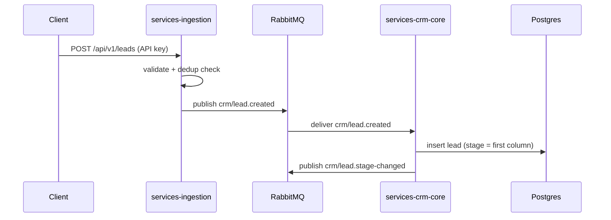

# Architecture Guide

Rules for how Beacon CRM's services are bounded, how they talk to each other, and how the
system is meant to be reasoned about. Every other guide assumes this one.

## Domain Map

Every service belongs to exactly one domain. A domain owns its Postgres tables outright — no
other service reads or writes them directly.

| Domain | Owns | Service | Feeds epic |
| --- | --- | --- | --- |
| `crm-core` | Organizations, users, pipelines, stages, leads, contacts, custom fields, activity timeline | `services-crm-core` | Epic 1, 3 |
| `ingestion` | API key issuance/scopes, public lead-capture endpoint, dedup logic | `services-ingestion` | Epic 2 |
| `automation` | Trigger rules, outgoing webhook delivery, retries, delivery audit log | `services-automation` | Epic 5 |
| `analytics` | KPI aggregation, conversion funnel, dashboard read APIs | `services-analytics` | Epic 4 |
| `billing` | Stripe subscription/plan state | `services-billing` | — |
| `notifications` | Resend email sending/templates | `services-notifications` | Epic 5 |

Epics referenced above are defined in [`INITIAL_PLAN.md`](../../INITIAL_PLAN.md).

## Service Boundary Rules

- **No cross-service DB reads.** If `automation` needs to know a lead's stage, it subscribes
  to `crm-core`'s events — it never queries `crm-core`'s tables.
- **A service is the only writer of its own tables.** Other services request changes via
  commands/events, not direct writes.
- **Shared logic lives in `packages/`,** never duplicated across services (e.g. a shared
  `packages/core` for Zod schemas/types, `packages/otel` for the OpenTelemetry setup,
  `packages/ui` for shared shadcn components consumed only by the frontend).
- **`organization_id` on every table, every query.** No exceptions — see
  [`security-limits.md`](./security-limits.md).

## Event Backbone

Three async tools, three distinct jobs. Using the wrong one for a job is an architecture
violation, not a style nit:

| Tool | Job | Examples |
| --- | --- | --- |
| **RabbitMQ** | Inter-service domain event bus. Fire-and-forget pub/sub. One topic exchange per domain (`crm.events`, `automation.events`, …). | `crm-core` publishes `crm/lead.created`; `automation` and `analytics` subscribe. |
| **Inngest** | Durable, observable, multi-step workflows needing retries/backoff/scheduling. Triggered by a RabbitMQ-consumed event or a cron. | The webhook-delivery engine (Epic 5), scheduled analytics rollups, digest emails. |
| **Redis** | Fast ephemeral state only — never durable business workflow state. | Response caching, API-key rate limiting, pub/sub for live Kanban-board updates. |

Domain events follow the naming convention `<domain>/<model>.[created|updated|deleted]`,
e.g. `crm/lead.created`, `automation/webhook.delivered`.

## Deployment Portability

Beacon ships two infra flavors of the same application code — see
[`infra-aws-serverless.md`](./infra-aws-serverless.md) and
[`infra-kubernetes.md`](./infra-kubernetes.md) for the full pictures. The rule that makes
that possible:

- **Application code is infra-agnostic.** 12-factor config via environment variables only.
  No cloud-SDK calls embedded in business logic (e.g. no `AWS.Lambda` client inside a NestJS
  service). No code path that only works on one flavor.
- Only Terraform/Helm/ArgoCD know which flavor is running. If a service needs to behave
  differently per flavor, that's a sign the abstraction is leaking — fix the abstraction, not
  the service.

| Flavor | Provisioning | Runtime | Event backbone |
| --- | --- | --- | --- |
| AWS Serverless | Terraform | NestJS on Lambda + API Gateway; Next.js via OpenNext/Amplify | Amazon MQ, ElastiCache, Inngest Cloud |
| Kubernetes | Terraform (cluster) + Helm + ArgoCD | Everything containerized | Self-hosted RabbitMQ/Redis/Inngest in-cluster |

Postgres stays managed (RDS) in both flavors.

## Future Monorepo Layout

Not created yet — this is the target shape each ADR should build toward:

```
apps/
  web/                  # Next.js BFF
services/
  crm-core/
  ingestion/
  automation/
  analytics/
  billing/
  notifications/
packages/
  core/                 # shared Zod schemas + inferred types
  ui/                   # shared shadcn components
  config/               # shared eslint/tsconfig/tailwind presets
  otel/                 # shared OpenTelemetry setup
infra/
  aws-serverless/terraform/
  kubernetes/{charts,argocd}/
```

## Sequence Diagram Convention

Use mermaid `sequenceDiagram` blocks in every ADR that introduces a new flow. Show data
flowing through the actual hops (HTTP → RabbitMQ → Inngest → Postgres), not a simplified
version:


